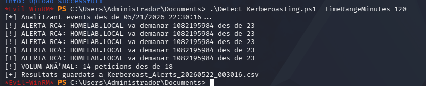
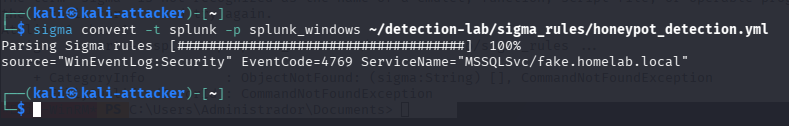
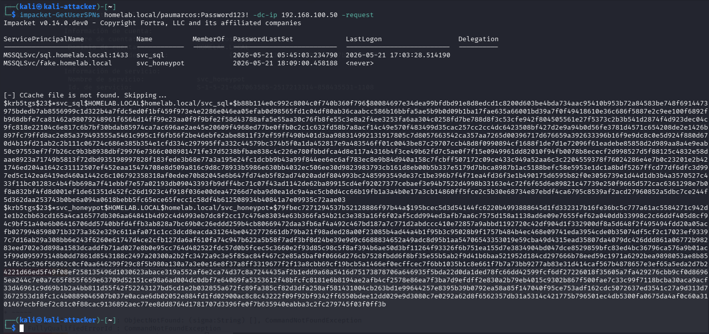

# Detection Engineering Lab: Kerberoasting Multi-Layer Detection

## Overview

This project demonstrates a multi-layer detection approach for Kerberoasting attacks in an Active Directory environment.

The lab combines:
- A honeypot service account
- Sigma rules converted to Splunk and Elastic EQL
- A PowerShell detection script with multiple detection layers

All detections are based on Windows Event ID 4769 (Kerberos Service Ticket Request).

---

## Lab Environment

| Component | IP | OS | Role |
|-----------|----|----|------|
| DC01 | 192.168.100.50 | Windows Server 2022 | Domain Controller |
| Kali | 192.168.100.10 | Kali Linux | Attacker Machine |
| Windows 10 | 192.168.100.30 | Windows 10 | Domain Client |

### Domain Information

- Domain: `homelab.local`
- Service Account: `svc_sql`
- Honeypot SPN: `MSSQLSvc/fake.homelab.local`

---

## Detection Layers

### 1. Sigma Rule – RC4 Encryption Detection

This rule detects TGS requests using RC4 encryption (0x17), commonly used during Kerberoasting attacks.

```yaml
title: Kerberoasting - RC4 Encryption Detected
id: 7b1a2c3d-4e5f-6a7b-8c9d-0e1f2a3b4c5d
status: experimental
description: Detects TGS requests with RC4 encryption used in Kerberoasting attacks.
references:
    - https://attack.mitre.org/techniques/T1558/003/
logsource:
    product: windows
    service: security
detection:
    selection:
        EventID: 4769
        TicketEncryptionType: 0x17
    filter:
        ServiceName|startswith:
            - 'cifs'
            - 'host'
    condition: selection and not filter
level: medium
tags:
    - attack.t1558.003
```

### Splunk Query

```spl
source="WinEventLog:Security" EventCode=4769 TicketEncryptionType=23 NOT (ServiceName IN ("cifs*", "host*"))
```

### Elastic EQL Query

```eql
any where winlog.channel:"Security" and (event.code:"4769" and winlog.event_data.TicketEncryptionType:"23" and not (service.name like~ ("cifs*", "host*")))
```

---

## 2. Honeypot Service Account Detection

A fake SPN (`MSSQLSvc/fake.homelab.local`) was attached to a dummy service account.

Any request to this SPN is considered suspicious and may indicate Kerberoasting activity.

### Sigma Rule

```yaml
title: Honeypot Service Account Access
id: 9d4e5f6a-7b8c-9d0e-1f2a-3b4c5d6e7f8a
status: experimental
description: Detects TGS requests to the honeypot SPN.
logsource:
    product: windows
    service: security
detection:
    selection:
        EventID: 4769
        ServiceName: "MSSQLSvc/fake.homelab.local"
    condition: selection
level: critical
tags:
    - attack.t1558.003
```

### Splunk Query

```spl
source="WinEventLog:Security" EventCode=4769 ServiceName="MSSQLSvc/fake.homelab.local"
```

---

## 3. PowerShell Multi-Layer Detection Script

The `Detect-Kerberoasting.ps1` script runs on the Domain Controller and:

- Detects RC4 encryption usage (0x17)
- Detects honeypot SPN access
- Detects abnormal TGS request volume from the same IP

The script was created to simulate simple SOC-style detection logic using native Windows logs.

---

## Attack Simulation

Kerberoasting activity was simulated from Kali Linux using Impacket.

```bash
impacket-GetUserSPNs homelab.local/USERNAME:PASSWORD -dc-ip 192.168.100.50 -request
```

This generated Kerberos TGS requests for the service accounts configured in the lab.

---

## Screenshots

### PowerShell Detection Script Output


### Event ID 4769 RC4 Detection


### Sigma Honeypot Rule Conversion


### Kerberoasting Attack Hashes


---

## SIEM Integration

The Sigma rules were converted to:
- Splunk queries
- Elastic EQL queries

This allows the detections to be reused across different SIEM platforms.

---

## Skills Demonstrated

- Detection Engineering
- Active Directory Security
- Kerberos Authentication Analysis
- Windows Event Log Analysis
- Sigma Rule Creation
- SIEM Querying
- Threat Detection
- PowerShell Scripting

---

## Repository Structure

```text
Detection-Engineering-Kerberoasting/
├── sigma_rules/
│   ├── kerberoasting_rc4.yml
│   └── honeypot_detection.yml
├── scripts/
│   └── Detect-Kerberoasting.ps1
├── siem_queries/
│   ├── splunk_rc4_search.txt
│   └── splunk_honeypot_search.txt
├── screenshots/
│   ├── 01_script_all_alerts.png
│   ├── 02_event_4769_rc4.png
│   ├── 03_sigma_honeypot_conversion.png
│   └── 04_attack_hashes.png
└── README.md
```

---

## References

- MITRE ATT&CK T1558.003 – Kerberoasting
- Microsoft Event ID 4769 Documentation
- Sigma Rules Project
