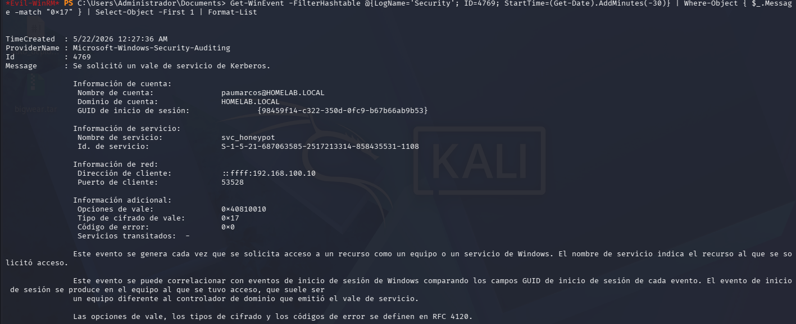

# Detection Engineering Lab

## Overview

This repository contains detection engineering use cases developed in a home SOC lab environment.

The goal of this project is to simulate real-world SOC detection workflows using Windows event logs, Active Directory attacks and custom detection logic.

The lab focuses on detecting Kerberoasting activity through:
- Windows Event ID 4769 analysis
- Sigma rules
- Splunk-style queries
- PowerShell detection scripts
- Honeypot service account monitoring

---

## Lab Environment

| System | Role | IP Address |
|---|---|---|
| Windows Server 2022 | Domain Controller | 192.168.100.50 |
| Windows 10 | Domain Joined Client | 192.168.100.30 |
| Kali Linux | Attacker Machine | 192.168.100.10 |

### Domain Information

- Domain: `homelab.local`
- Service Account: `svc_sql`
- Honeypot SPN: `MSSQLSvc/fake.homelab.local`

---

## Technologies Used

- Active Directory
- Windows Event Logs
- Sigma Rules
- Splunk Queries
- PowerShell
- Impacket
- Kali Linux
- VirtualBox

---

## Detection Use Cases

### Kerberoasting Detection

Detection of suspicious Kerberos TGS requests using:
- Event ID 4769
- RC4 encryption monitoring
- SPN request analysis

### Honeypot Service Account Detection

A fake service account SPN was created to detect unauthorized Kerberos ticket requests.

Any request to this SPN is considered highly suspicious.

### Volume-Based Detection

Custom PowerShell logic was used to identify abnormal volumes of TGS requests from the same source.

---

## Attack Simulation

Kerberoasting activity was simulated from Kali Linux using Impacket tools.

```bash
impacket-GetUserSPNs homelab.local/USERNAME:PASSWORD -dc-ip 192.168.100.50 -request
```

The attack generated Kerberos TGS requests which were analyzed through custom detections.

---

## Detection Examples

### Sigma Rule – Kerberoasting Detection

```yaml
title: Kerberoasting RC4 Detection
logsource:
    product: windows
    service: security
detection:
    selection:
        EventID: 4769
        TicketEncryptionType: 0x17
condition: selection
```

### Splunk Query Example

```spl
source="WinEventLog:Security" EventCode=4769 TicketEncryptionType=23
```

---

## Screenshots

### Kerberoasting Attack


### Event ID 4769 Detection


### Sigma Rule Detection


---

## Skills Demonstrated

- Detection Engineering
- Active Directory Security
- Kerberos Authentication Analysis
- Windows Log Analysis
- Sigma Rule Creation
- SIEM Querying
- Threat Detection
- Security Monitoring


## Disclaimer

This project was created in a controlled home lab environment for educational and defensive security purposes only.
